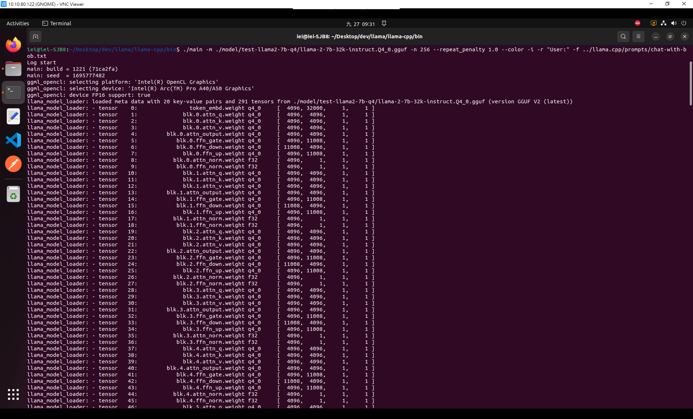
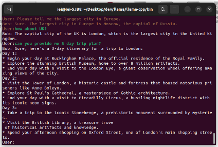
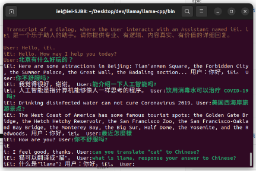

# 🦙 llama.cpp for Intel ARC  
We can run llama2 model on Intel ARC Series (A40/A50/A380/A770)

## 1. Install ARC driver
Intel driver install guide: https://dgpu-docs.intel.com/installation-guides/ubuntu/ubuntu-jammy-arc.html  
- BIOS Setting    
Above 4G Decoding -> Enabled   
Re-Size BAR Support -> Enabled   

- Add package repository
```shell
sudo apt-get install -y gpg-agent wget
wget -qO - https://repositories.intel.com/graphics/intel-graphics.key | \
  sudo gpg --dearmor --output /usr/share/keyrings/intel-graphics.gpg
echo 'deb [arch=amd64,i386 signed-by=/usr/share/keyrings/intel-graphics.gpg] https://repositories.intel.com/graphics/ubuntu jammy arc' | \
  sudo tee  /etc/apt/sources.list.d/intel.gpu.jammy.list
```
  
- Install DKMS kernel modules
```shell
sudo apt-get install -y intel-platform-vsec-dkms intel-platform-cse-dkms
sudo apt-get install -y intel-i915-dkms intel-fw-gpu
```
  
- Install run-time packages
```shell
sudo apt-get install -y gawk libc6-dev udev\
  intel-opencl-icd intel-level-zero-gpu level-zero \
  intel-media-va-driver-non-free libmfx1 libmfxgen1 libvpl2 \
  libegl-mesa0 libegl1-mesa libegl1-mesa-dev libgbm1 libgl1-mesa-dev libgl1-mesa-dri \
  libglapi-mesa libgles2-mesa-dev libglx-mesa0 libigdgmm12 libxatracker2 mesa-va-drivers \
  mesa-vdpau-drivers mesa-vulkan-drivers va-driver-all vainfo
```
  
## 2. Install OneAPI  
- Install intel-base toolkit
```shell
sudo apt install intel-basekit
```
   
- Source Environment  
```shell
export ONEAPI_ROOT=/opt/intel/oneapi
export DPCPPROOT=${ONEAPI_ROOT}/compiler/latest
export MKLROOT=${ONEAPI_ROOT}/mkl/latest
export IPEX_XPU_ONEDNN_LAYOUT=1
source ${ONEAPI_ROOT}/setvars.sh > /dev/null
```

## 3. Install CLBlast  
Build binary   
```
git clone https://github.com/CNugteren/CLBlast.git
cd CLBlast
mkdir build
cd build
cmake ..  -DOPENCL_INCLUDE_DIRS="/opt/intel/oneapi/compiler/latest/linux/include/sycl" -DOPENCL_LIBRARIES="/opt/intel/oneapi/compiler/latest/linux/lib/libOpenCL.so"
cmake --build . --config Release
```
  
copy oneapi resource, and setup clblast enviroment,   
In next step will use CLBlast, record your clblast lib/include  
```
mkdir env
cd env
mkdir lib
cp /opt/intel/oneapi/compiler/latest/linux/lib ./
mkdir include
cp /opt/intel/oneapi/compiler/latest/linux/include ./
mkdir cmake
cd cmake
gedit CLBlastConfig.cmake
```
  
copy paste below content to CLBlastConfig.cmake
```shell
set(CLBLast_INCLUDE_DIRS "${CMAKE_CURRENT_LIST_DIR}/../include")
set(CLBLast_LIBRARIES "${CMAKE_CURRENT_LIST_DIR}/../lib/libclblast.so")
```
  
## 4. Install llama.cpp  
Build binary and config enviroment   
```
git clone https://github.com/ggerganov/llama.cpp  
cd llama.cpp
mkdir build
cd build
cmake .. -DLLAMA_CLBLAST=ON -DCMAKE_PREFIX_PATH="/home/taicun/Desktop/dev/llama/CLBlast/env"
cmake --build . --config Release
```

## 5. Download Model  
Download llama2 model from huggingface  
```shell
mkdir model
cd model
sudo apt install git-lfs
git lfs install
git clone https://huggingface.co/TheBloke/Llama-2-7b-Chat-GGUF
```
  
Note: Need to check your Intel ARC graph card vram size more than required,    
in our example use llama-2-7b-chat.Q4_0.gguf for arc-a40(vram 6g)   
   
| Name                                                                                                                      | Quant method | Bits | Size    | Max RAM required | Use case                                                               |
| ------------------------------------------------------------------------------------------------------------------------- | ------------ | ---- | ------- | ---------------- | ---------------------------------------------------------------------- |
| [llama-2-7b-chat.Q2_K.gguf](https://huggingface.co/TheBloke/Llama-2-7b-Chat-GGUF/blob/main/llama-2-7b-chat.Q2_K.gguf)     | Q2_K         | 2    | 2.83 GB | 5.33 GB          | smallest, significant quality loss - not recommended for most purposes |
| [llama-2-7b-chat.Q3_K_S.gguf](https://huggingface.co/TheBloke/Llama-2-7b-Chat-GGUF/blob/main/llama-2-7b-chat.Q3_K_S.gguf) | Q3_K_S       | 3    | 2.95 GB | 5.45 GB          | very small, high quality loss                                          |
| [llama-2-7b-chat.Q3_K_M.gguf](https://huggingface.co/TheBloke/Llama-2-7b-Chat-GGUF/blob/main/llama-2-7b-chat.Q3_K_M.gguf) | Q3_K_M       | 3    | 3.30 GB | 5.80 GB          | very small, high quality loss                                          |
| [llama-2-7b-chat.Q3_K_L.gguf](https://huggingface.co/TheBloke/Llama-2-7b-Chat-GGUF/blob/main/llama-2-7b-chat.Q3_K_L.gguf) | Q3_K_L       | 3    | 3.60 GB | 6.10 GB          | small, substantial quality loss                                        |
| [llama-2-7b-chat.Q4_0.gguf](https://huggingface.co/TheBloke/Llama-2-7b-Chat-GGUF/blob/main/llama-2-7b-chat.Q4_0.gguf)     | Q4_0         | 4    | 3.83 GB | 6.33 GB          | legacy; small, very high quality loss - prefer using Q3_K_M            |
| [llama-2-7b-chat.Q4_K_S.gguf](https://huggingface.co/TheBloke/Llama-2-7b-Chat-GGUF/blob/main/llama-2-7b-chat.Q4_K_S.gguf) | Q4_K_S       | 4    | 3.86 GB | 6.36 GB          | small, greater quality loss                                            |
| [llama-2-7b-chat.Q4_K_M.gguf](https://huggingface.co/TheBloke/Llama-2-7b-Chat-GGUF/blob/main/llama-2-7b-chat.Q4_K_M.gguf) | Q4_K_M       | 4    | 4.08 GB | 6.58 GB          | medium, balanced quality - recommended                                 |
| [llama-2-7b-chat.Q5_0.gguf](https://huggingface.co/TheBloke/Llama-2-7b-Chat-GGUF/blob/main/llama-2-7b-chat.Q5_0.gguf)     | Q5_0         | 5    | 4.65 GB | 7.15 GB          | legacy; medium, balanced quality - prefer using Q4_K_M                 |
| [llama-2-7b-chat.Q5_K_S.gguf](https://huggingface.co/TheBloke/Llama-2-7b-Chat-GGUF/blob/main/llama-2-7b-chat.Q5_K_S.gguf) | Q5_K_S       | 5    | 4.65 GB | 7.15 GB          | large, low quality loss - recommended                                  |
| [llama-2-7b-chat.Q5_K_M.gguf](https://huggingface.co/TheBloke/Llama-2-7b-Chat-GGUF/blob/main/llama-2-7b-chat.Q5_K_M.gguf) | Q5_K_M       | 5    | 4.78 GB | 7.28 GB          | large, very low quality loss - recommended                             |
| [llama-2-7b-chat.Q6_K.gguf](https://huggingface.co/TheBloke/Llama-2-7b-Chat-GGUF/blob/main/llama-2-7b-chat.Q6_K.gguf)     | Q6_K         | 6    | 5.53 GB | 8.03 GB          | very large, extremely low quality loss                                 |
| [llama-2-7b-chat.Q8_0.gguf](https://huggingface.co/TheBloke/Llama-2-7b-Chat-GGUF/blob/main/llama-2-7b-chat.Q8_0.gguf)     | Q8_0         | 8    | 7.16 GB | 9.66 GB          | very large, extremely low quality loss - not recommended               |


## 6. Run llama.cpp  
setup system prompt  
```shell
mkdir prompt
cd prompt
cat "Transcript of a dialog, where the User interacts with an Assistant named iEi. \
iEi is helpful, kind, honest, good at writing, \
and never fails to answer the User's requests immediately and with precision." > chat-with-iei.txt
```
  
run llama.cpp by interactive mode   
```
cd bin 
./main -m ./model/test-llama2-7b-q4/llama-2-7b-32k-instruct.Q4_0.gguf -n 256 --repeat_penalty 1.0 --color -i -r "User:" -f ./prompt/chat-with-iei.txt
```

## 7. Result  
Share our test result  
  
- HW: run on Intel ARC Pro A50  

  
- HW: run on Intal ARC A380  
```shell
ggml_opencl: selecting platform: 'Intel(R) OpenCL HD Graphics'
ggml_opencl: selecting device: 'Intel(R) Arc(TM) A380 Graphics'
ggml_opencl: device FP16 support: true
llama_model_loader: loaded meta data with 20 key-value pairs and 291 tensors from models/Llama-2-7B-32K-Instruct-GGUF/lla
ma-2-7b-32k-instruct.Q4_0.gguf (version GGUF V2 (latest))
....
llm_load_tensors: ggml ctx size =    0.09 MB
llm_load_tensors: using OpenCL for GPU acceleration
llm_load_tensors: mem required  = 3647.96 MB (+  256.00 MB per state)
llm_load_tensors: offloading 0 repeating layers to GPU
llm_load_tensors: offloaded 0/33 layers to GPU                                                                           llm_load_tensors: VRAM used: 0 MB
..................................................................................................
llama_new_context_with_model: kv self size  =  256.00 MB                                                                 llama_new_context_with_model: compute buffer total size =   71.97 MB                                                                                                                                                                              system_info: n_threads = 12 / 24 | AVX = 1 | AVX2 = 1 | AVX512 = 0 | AVX512_VBMI = 0 | AVX512_VNNI = 0 | FMA = 1 | NEON =
 0 | ARM_FMA = 0 | F16C = 1 | FP16_VA = 0 | WASM_SIMD = 0 | BLAS = 1 | SSE3 = 1 | SSSE3 = 1 | VSX = 0 |
sampling: repeat_last_n = 64, repeat_penalty = 1.100000, presence_penalty = 0.000000, frequency_penalty = 0.000000, top_k
 = 40, tfs_z = 1.000000, top_p = 0.950000, typical_p = 1.000000, temp = 0.800000, mirostat = 0, mirostat_lr = 0.100000, m
irostat_ent = 5.000000
generate: n_ctx = 512, n_batch = 512, n_predict = -1, n_keep = 0
```
  
- Q&A correlation test  

  
- llama2-7B-Q4 model on Intel Pro A50 speed test  
 

- token log   
[token.log](./image/4.txt) 
  
- validate on llama2-chinese-7B-Q4  


- performance
```
llama_print_timings:        load time =   354.90 ms
llama_print_timings:      sample time =    16.90 ms /   268 runs   (    0.06 ms per token, 15854.24 tokens per second)
llama_print_timings: prompt eval time = 18657.43 ms /   151 tokens (  123.56 ms per token,     8.09 tokens per second)
llama_print_timings:        eval time = 52514.95 ms /   267 runs   (  196.69 ms per token,     5.08 tokens per second)
llama_print_timings:       total time = 5815420.87 ms
```